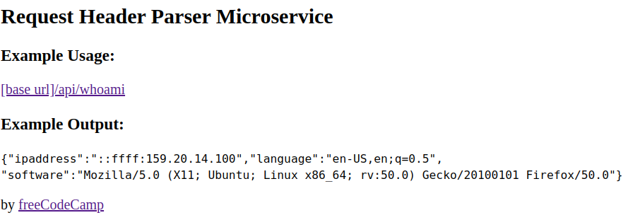

# Request Header Parser Microservice

### www.freecodecamp.com proposes this project in JavaScript so I did it in Golang.
### Task
* You should provide your own project, not the example URL.
* request to /api/whoami should return a JSON object with your IP address in the ipaddress key.
* A request to /api/whoami should return a JSON object with your preferred language in the language key.
* A request to /api/whoami should return a JSON object with your software in the software key.

## REST API Response Format

* GET localhost:8080/

* GET http://localhost:8080/api/whoami

{"ipaddress":"","language":"en-US,en;q=0.9","software":"Mozilla/5.0 (X11; Linux x86_64) AppleWebKit/537.36 (KHTML, like Gecko) Chrome/108.0.0.0 Safari/537.36"}
